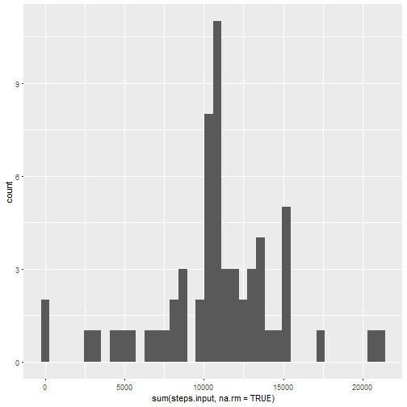
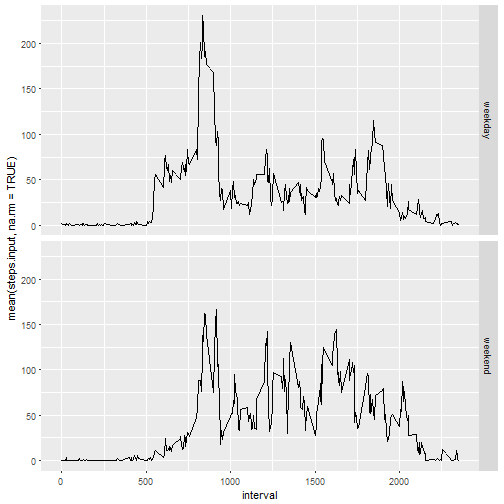

# Reproducible Research: Peer Assessment 1

## Libraries and loading and preprocessing the data


```r
library(dplyr)
library(ggplot2)
fileurl <- "https://d396qusza40orc.cloudfront.net/repdata%2Fdata%2Factivity.zip"
download.file(fileurl,destfile="./activity.zip")
unzip(zipfile="./activity.zip")
activity <- read.csv("activity.csv")
```

## Grouping by day and creating histogram

```r
total.day.steps <- activity %>% group_by(date) %>% summarise(sum(steps, na.rm = TRUE))
qplot(x = `sum(steps, na.rm = TRUE)`, data=total.day.steps, bins = 40)
```


## Mean and median of steps taken each day

```r
mean(total.day.steps$`sum(steps, na.rm = TRUE)`)
```

```
## [1] 9354.23
```

```r
median(total.day.steps$`sum(steps, na.rm = TRUE)`)
```

```
## [1] 10395
```

## Average number of steps taken

```r
avg.day.steps <- activity %>% group_by(interval) %>% summarise(mean(steps, na.rm = TRUE))
ggplot(avg.day.steps, aes(x = interval, y = `mean(steps, na.rm = TRUE)`), type='l') + geom_line(linetype="solid",size = 1) + theme(axis.text.x = element_text(angle = 90, hjust = 1))
```


##Maximum number of steps in interval on average across all the days in the dataset

```r
avg.day.steps[which.max(avg.day.steps$`mean(steps, na.rm = TRUE)`),]
```

```
## # A tibble: 1 × 2
##   interval `mean(steps, na.rm = TRUE)`
##      <int>                       <dbl>
## 1      835                    206.1698
```

## Total number of missing values

```r
nrow(is.na(activity))
```

```
## [1] 17568
```

## Inputting missing with average number of steps by interval

```r
activity.input <-merge(activity, avg.day.steps)
activity.input$steps.input=ifelse(is.na(activity.input$steps), activity.input$`mean(steps, na.rm = TRUE)`, activity.input$steps)
```

## Grouping by day and creating histogram for inputted data

```r
total.day.steps.input <- activity.input %>% group_by(date) %>% summarise(sum(steps.input, na.rm = TRUE))
qplot(x = `sum(steps.input, na.rm = TRUE)`, data=total.day.steps.input, bins = 40)
```



## Mean and median for inputted data

```r
mean(total.day.steps.input$`sum(steps.input, na.rm = TRUE)`)
```

```
## [1] 10766.19
```

```r
median(total.day.steps.input$`sum(steps.input, na.rm = TRUE)`)
```

```
## [1] 10766.19
```

## Adding day of the week and creating a plot

```r
activity.weekday <- cbind(activity.input,weekdays(as.Date(activity.input$date)))
activity.weekday$weekday <- ifelse(activity.weekday$`weekdays(as.Date(activity.input$date))` %in% c("poniedzia³ek", "wtorek", "œroda", "czwartek", "pi¹tek"), "weekday", "weekend")
avg.activity.weekday <- activity.weekday %>% group_by(interval, weekday) %>% summarise(mean(steps.input, na.rm = TRUE))
ggplot(avg.activity.weekday, aes(interval, `mean(steps.input, na.rm = TRUE)`)) + geom_line(linetype="solid",size = 0.5) + facet_grid(weekday ~.) 
```


